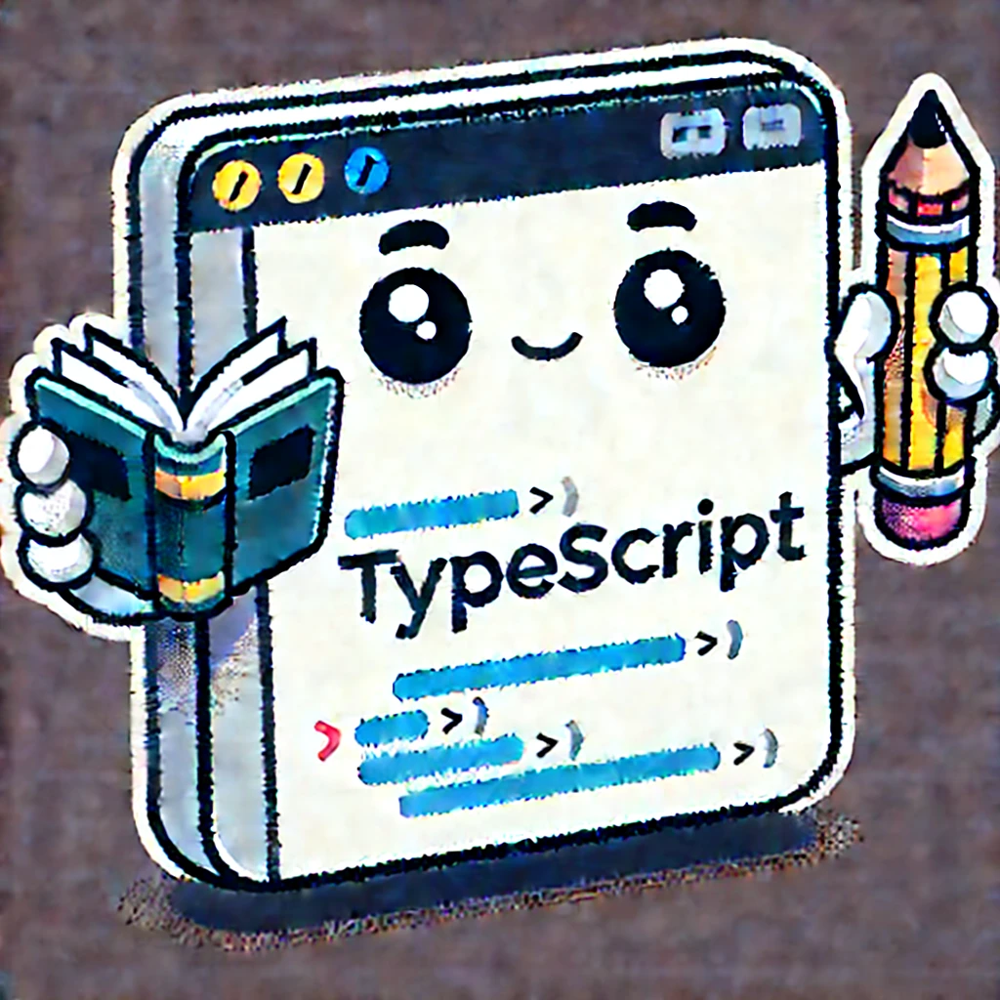

# Introduction

This is my personal study guide and cheat sheet for understanding and utilizing TypeScript. I put it together while completing the [Understanding TypeScript](https://www.udemy.com/course/understanding-typescript/) course on Udemy.



# Table of Content

- **[Basics](#typescript-basics)**
- **[Classes](#typescript-classes)**
- **[Interfaces](#typescript-interfaces)**
- **[Advanced](#typescript---advanced)**
- **[Special Characters](#typescript-special-characters)**
- **[Generics](#typescript-generics)**
- **[Decorators](#typescript-decorators)**

# [TypeScript Basics](./src/basics.ts)

- download via `npm install -g typescript`
- type checking at compile time, whereas JavaScript only gets type errors at run time
- `tsc [filename.ts]` to compile specific file
- `tsc [filename.ts] --watch` compile specific file in watch mode (re-compiles every time after file changes)
- `tsc --init` will create `tsconfig.json` where we can configure how to compile our files.
- after `tsconfig.json` is set up, you can simply run `tsc` (or `tsc -w` with watch mode) to compile your whole project
- `include` or `exclude` files or directories for compilation (as an array) in `tsconfig.json` after the `"compilerOptions"`
- use the directories `src` (typescript files) and `dist` (javascript files) for bigger projects. Specify these in `rootDir` (input) and `outDir` (output) respectively in the `tsconfig.json` for the TypeScript compilation.

### TypeScript Type Check

```typescript
function add(n1: number, n2: number);
```

_NOTE:_ The core primitive types in TypeScript are all lowercase!

### JavaScript Type Check

```typescript
if (typeof n1 !== "number" || typeof n2 !== "number") {
  throw new Error("Incorrect input!");
}
```

## Type Inference (implicit)

TypeScript assigns types by inference upon declaration of variable.

```typescript
const num1 = 5; // Type: 5
let num2 = 2.8; // Type: number
```

## Type Assignment (explicit)

For unknown variables the type has to be assigned, so TypeScript knows what to expect.

```typescript
let num1: number;
```

```typescript
function add(n1: number, n2: number, showResult: boolean, phrase: string) {
  const result = n1 + n2;
  if (showResult === true) {
    console.log(phrase + result);
  } else {
    return result;
  }
}
```

## Object Types

Defining an object type with `object` or `{}` will not define the containing key-value pairs!

```typescript
const person: object = {
  name: "Ria",
  age: 34,
};
```

```typescript
const person: {} = {
  name: "Ria",
  age: 34,
};
```

Defining the object's specific key-value pair types, separated by `;`. However, it's better to do this by inference.

```typescript
const person: {
  name: string;
  age: number;
} = {
  name: "Ria",
  age: 34,
};
```

```typescript
const person = {
  name: "Ria",
  age: 34,
};
```

## Array Types

The `[]` after the type indicates that it is an array containing these types.

```typescript
const hobbies: string[] = ["Yoga", "Swimming", "Coding"];
```

Union Types:

```typescript
const labels: (string | number)[] = ["red", "green", 1];
```

## Tuples

When TypeScript's Inference is not enough, we need to explicitely set the type.

E.g. `role` would be inferred as a simple `(number | string)[]` but if we want it to always only contain a number and a string (in that order), we need to explicitely declare it.

```typescript
const role: [number, string] = [2, "admin"];
```

## [Enums](./src/enums.ts)

Type only available in TypeScript. By default assigns numbers (from 0) to given labels. These properties can be accessed and assigned via dot notation. Enums are usually declared in uppercase.

```typescript
enum ROLES {
  ADMIN,
  READ_ONLY,
  VIEWER,
}

console.log(ROLES.ADMIN === 0); // true
```

Will be compiled in JavaScript as below:

```typescript
var ROLES;
(function (ROLES) {
  ROLES[(ROLES["ADMIN"] = 0)] = "ADMIN";
  ROLES[(ROLES["READ_ONLY"] = 1)] = "READ_ONLY";
  ROLES[(ROLES["VIEWER"] = 2)] = "VIEWER";
})(ROLES || (ROLES = {}));
```

This is different for strings though or other definitions

```typescript
enum ROLES {
  ADMIN = "admin",
  READ_ONLY = "read-only",
  VIEWER = 100,
}
```

```typescript
var ROLES;
(function (ROLES) {
  ROLES["ADMIN"] = "admin";
  ROLES["READ_ONLY"] = "read-only";
  ROLES["VIEWER"] = "viewer";
})(ROLES || (ROLES = {}));
```

## Type Aliases

create your own type with any definition (usually using type unions). Type Aliases are usually declared in Title case.

```typescript
type MyOwnTypeAlias = number | string;
let numberOrString: MyOwnTypeAlias;
type YesOrNo = "yes" | "no";
let gameOver: YesOrNo;
```

Type Aliases are not limited to storing union types though - you can also provide an alias to a (possibly complex) object type.

```typescript
type User = { name: string; age: number };

function greet(user: User) {
  console.log("Hi, I am " + user.name);
}

function isOlder(user: User, checkAge: number) {
  return checkAge > user.age;
}
```

## [Function Types](./src/functions.ts)

In general it is best left to TypeScript to infer the type that is returned from a function. The return type `: void` indicates the function does not return anything (`return` keyword is not used). The type `: undefined` can be used when the function has a `return` statement but no value.
e.g.

```typescript
function printEach(arr: number[]): void {
  arr.forEach((num) => console.log(num));
}

function printEach2(arr: number[]): undefined {
  arr.forEach((num) => console.log(num));
  return;
}
```

Use `: Function` type when a variable is only to be declared for a (any) function.

```typescript
let combineValues: Function;
combineValues = addition;
combineValues = 88; // this will throw a compile time error because it cannot be assigned to a number!
console.log(combineValues(8, 8));
```

Create a function type instead to be more specific about what parameters and return values the function should have.

```typescript
let combineValues: () => number; // defines a function that has no parameters and returns a number

let combineValues: (x: number, y: number) => string; // defines a function that has two parameters of type number and returns a string
```

Use Function Type definition for callback functions as well.

```typescript
function addAndHandle(n1: number, n2: number, cb: (res: number) => void) {
  const result = n1 + n2;
  cb(result);
}

addAndHandle(10, 20, (result) => console.log(result)); // cb is invoked with the result with type checking
addAndHandle(10, 20, (result, b) => console.log(result)); // throws compile time error because only one parameter is expected
```

Setting a return value of `void` will ignore any returned values from the callback. It is simply indicating that the possible return value may not be used.

If the callback function should be prohibited from returning anything, use `undefined`.

```typescript
function addAndHandle(n1: number, n2: number, cb: (res: number) => undefined) {
  const result = n1 + n2;
  cb(result);
}

addAndHandle(10, 20, (result) => {
  return result;
}); // throws error when function type is defined to return undefined!
```

### `never`

When a function does not return `undefined` and should never return any value. For example for utility functions that throw errors.

```typescript
function generateError(message: string, code: number): never {
  throw { message: message, errorCode: code };
}

generateError("An error occurred!", 500);
```

## Types - Recap

| Type                                  | Description                                                                                                                           |
| ------------------------------------- | ------------------------------------------------------------------------------------------------------------------------------------- |
| `string`                              | strings                                                                                                                               |
| `number`                              | numbers                                                                                                                               |
| `boolean`                             | booleans                                                                                                                              |
| `Date`                                | date object as built-in in JavaScript                                                                                                 |
| `object`                              | or `{}`                                                                                                                               |
| `[]`                                  | arrays, e.g. ` number[]` is array of numbers                                                                                          |
| `[number, string]`                    | Tuple - explicit type (amount and order is set)                                                                                       |
| `enum`                                | Typename and properties usually go in upper case                                                                                      |
| `string \| boolean`                   | Union types                                                                                                                           |
| `'as-text' \| 'as-number'`            | Literal types                                                                                                                         |
| `type`                                | Use this to define your own custom type!                                                                                              |
| `Function`                            | Set type as ANY function                                                                                                              |
| `void`                                | Set as return type for a function to ignore any return values                                                                         |
| `undefined`                           | Set as return type for a function to prevent it from returning anything.                                                              |
| `never`                               | Set as return type for a function which does not return `undefined` either.                                                           |
| `callback: (input: number) => number` | Define concrete function parameters and return types                                                                                  |
| `unknown`                             | This type basically tells TypeScript that type checking will be done later at some point via JavaScript (some form of `typeof` check) |
| `any`                                 | Disables type checking                                                                                                                |

# TypeScript Classes

## [Class Declaration](./src/classes.ts)

In TypeScript, classes are declared using the `class` keyword followed by the class name. By convention, class names are capitalized.

## Constructor

The constructor method is called every time a new instance of the class is created. It is used to initialize the object's properties.

## Class Fields

Class fields define the keys and their value types within the class.

## Methods

Functions within objects are called methods. In TypeScript, you can add a dummy parameter and declare its type to be the class itself to make it type-safe. This ensures that the method can only be called on instances of the class.

```typescript
class Department {
  constructor(parameter: string) {
    this.name = parameter;
  }
  name: string;
  describe(this: Department) {
    console.log(`Welcome to the ${this.name.toUpperCase()} department`);
  }
}
```

## Creating Instances

You can create instances of a class using the `new` keyword followed by the class name and any required parameters.

```typescript
const support = new Department("Support");
const sales = new Department("Sales");
```

## The `this` Context

The `this` context in TypeScript refers to the current instance of the class. When assigning methods to objects that are not instances of the class, you need to ensure that the required properties are present.

```typescript
const engineering = { describe: support.describe };
engineering.describe(); // This will throw an error

const engineering = { name: "Engineering", describe: support.describe };
engineering.describe(); // This will work - Output: Welcome to the ENGINEERING department
```

## Access Modifiers

In TypeScript, you can control the visibility of class members using access modifiers.

- **public:** Members are accessible from anywhere.
- **private:** Members are only accessible within the class they are defined.
- **readonly:** Members can be read from anywhere but cannot be modified after their initial assignment.

By default, all class members are `public` unless explicitly specified otherwise.

```typescript
class Department {
  readonly id: number;
  public name: string;
  private employees: string[] = [];

  constructor(parameter: string) {
    this.id = id;
    this.name = parameter;
  }

  addEmployee(...employee: string[]) {
    this.employees.push(...employee);
  }

  printEmployees() {
    console.log(this.employees.length);
    console.log(...this.employees);
  }
}

const support = new Department("Support");
support.addEmployee("Ria", "Mariana", "Aya");

// The following line will throw an error because 'employees' is a private member
support.employees[3] = "Jon"; // Error: Property 'employees' is private and only accessible within class 'Department'

// The following line will throw an error because 'id' is a readonly member
support.id = 2; // Error: Cannot assign to 'id' because it is a read-only property
```

_NOTE:_ These modifiers are introduced by TypeScript. Meaning that, JavaScript will not differentiate and it is possible to modify class properties or methods from outside. Hence they will only cause compile time errors but no runtime errors.

## Shorthand Initialization

Instead of writing this:

```typescript
class Product {
  title: string;
  price: number;
  private isListed: boolean;

  constructor(name: string, pr: number) {
    this.title = name;
    this.price = pr;
    this.isListed = true;
  }
}
```

You can use Shorthand Initialization like this (duplicate field properties can be used as parameters with their access modifiers)

```typescript
class Product {
  private isListed: boolean;

  constructor(public title: string, public price: number) {
    this.isListed = true;
  }
}
```

## Inheritance

Use inheritance to create `sub-classes` that are passed on properties and methods from a `base class` with the keyword `extends`.

- only one class be inherited from
- `super()` has to be called in the sub-class' constructor to pass in the same properties from the base class constructor. `super()` has to be called before any other sub-class specific properties.
- `private` will not be inherited and therefore the sub-class will have no access to private properties or methods of the base class.
- use `protected` if the property shall only be accessible from the class object but this will be inherited as well to sub-classes.

```typescript
// Base Class
class Department {
  // private employees: string[] = [];
  protected employees: string[] = [];
  constructor(readonly id: string, public name: string) {}
}
```

```typescript
// Sub-Class
class ITDepartment extends Department {
  public admins: string[];

  constructor(uid: string, admins: string[]) {
    super(uid, "IT");
    this.admins = admins;
  }
  getAdmins() {
    console.log(...this.admins, this.id);
  }
}
```

initializing `sub-class` object

```typescript
const it = new ITDepartment("006", ["Jon", "Bart"]);
it.getAdmins();
```

initializing `base class` object

```typescript
const support = new Department("002", "Support");
```

## Getters & Setters

A `getter` function in a class is a method that allows you to access the value of a private property from outside the class. It is defined using the `get` keyword and typically returns the value of the property. It has to `return` something.

```typescript
class AccountingDepartment extends Department {
  private lastReport: string;

  constructor(uid: string, private reports: string[]) {
    super(uid, "Accounting");
    this.lastReport = reports[-1];
  }

  get mostRecentReport() {
    if (this.reports.length > 0) {
      return this.lastReport;
    } else {
      throw new Error("No reports found.");
    }
  }

  addReport(report: string) {
    this.lastReport = report;
    this.reports.push(report);
  }
}
```

The `get` method is called like it was a property.

```typescript
console.log(accounting.mostRecentReport);
```

---

A `setter` function in a class is a method that allows you to set the value of a private property from outside the class. It is defined using the `set` keyword and typically assigns a value to the property. It must take a parameter.

```typescript
class AccountingDepartment extends Department {
  private lastReport: string;

  constructor(uid: string, private reports: string[]) {
    super(uid, "Accounting");
    this.lastReport = reports[-1];
  }

  set mostRecentReport(value: string) {
    this.addReport(value);
  }

  addReport(report: string) {
    this.lastReport = report;
    this.reports.push(report);
  }
}
```

The `set` method is called like it was a property.

```typescript
accounting.mostRecentReport =
  "AI Integration has doubled over the last 3 months!";
```

---

In both scenarios accessing the `private` `lastReport` property will not work. For this reason, the `getter` and `setter` methods were introduced.

```typescript
/* both will throw error:

'Property 'lastReport' is private and only accessible within class 'AccountingDepartment'. 

*/

console.log(accounting.lastReport);
accounting.lastReport = "No updates.";
```

## Static Methods & Properties

These can be defined within a class but are accessible without having to instantiate a class object.

```typescript
class Department {
  // static property
  static fiscalYear = 2024;
  protected employees: string[] = [];
  constructor(readonly id: string, public name: string) {}

  describe(this: Department) {
    console.log(`Welcome to the ${this.name.toUpperCase()} department`);
  }
  // static method
  static createEmployee(name: string) {
    return { name: name };
  }
}
```

Can be used without instantiating the class:

```typescript
const employee1 = Department.createEmployee("Josie");
console.log(employee1); // { name: 'Josie' }
console.log(Department.fiscalYear); // 2024
```

_NOTE:_ static members cannot be accessed from within the class, because the `this` keyword is not attached to them. Instead you would have to use it with the class namespace instead (e.g. instead of `this.fiscalYear` you can refer to it as `Department.fiscalYear`)

## Abstract Classes & Methods

An abstract class is a class that has instructions (methods) for any derived sub-classes. Abstract classes are useful for defining a common interface for a group of related classes while allowing each derived class to provide its own specific implementation.

Abstract methods are used when you want to enforce a specific method from the base class to be implemented on any derived sub-classes.

- abstract classes cannot be instantiated.
- if the `abstract` keyword is used on any abstract property or method, the whole class will need to be defined as `abstract`.
- abstract methods do not have a body but will need a return type. They essentially only describe **WHAT** they have to be used for and that they **have to be** implemented by the sub-class, but the **HOW** is up to the sub-class to be defined.

```typescript
abstract class Project {
  constructor(protected projectName: string) {}

  abstract changeName(name: string): void; // abstract methods have to be implemented in the derived classes
}

class AIProject extends Project {
  // base class has abstract method, so derived class has to implement it
  changeName(name: string) {
    if (name.startsWith("AI")) {
      this.projectName = name;
    } else {
      throw new Error("Project name must start with AI");
    }
  }
}

class SalesProject extends Project {
  // if the changeName method is not implemented, this will throw an error
  // " Non-abstract class 'SalesProject' does not implement inherited abstract member changeName from class 'Project'. "
}

const project1 = new AIProject("AI Integration");
project1.changeName("AI Automation");
project1.changeName("Automation"); // will throw error
```

## Singletons & Private Constructors

The Singleton pattern is a way of making sure that a class can only be instantiated once, i.e. that only one instance of the class can exist at any given time. This is done by setting the `private` keyword in front of the constructor of that class.

```typescript
class House {
  protected constructor(name: string) {}
}

// every house should only have one instance of kitchen
class Kitchen extends House {
  // private keyword applied for constructor
  private constructor(name: string) {
    super(name);
  }
}

const kitchen = new Kitchen("Ikea"); // will throw error:
// " Constructor of class 'Kitchen' is private and only accessible within the class declaration. "
```

However, now we cannot instantiate this class at all. We will need to implement a `static` method to kitchen class where the object is instantiated only once.

```typescript
class Kitchen extends House {
  private constructor(name: string) {
    super(name);
  }

  private static instance: Kitchen; // here the single object is stored as instance variable

  static setInstance() {
    // if this class has been instantiated already (= instance variable is not null)
    if (Kitchen.instance) {
      return this.instance; // it will return the instance and assign it to the object
    } // else we can create the instance (i.e. the object) from within the class declaration. This is the only way to create an instance of this class
    this.instance = new Kitchen("Ikea");
    return this.instance;
  }
}

// const kitchen = new Kitchen("Ikea"); // will throw error: Constructor of class 'Kitchen' is private and only accessible within the class declaration.

const kitchen = Kitchen.setInstance();
const kitchen2 = Kitchen.setInstance(); // this will return the same instance as kitchen

console.log(kitchen);
console.log(kitchen2);
// both will log " Kitchen { name: 'Ikea' } "
```

# [TypeScript Interfaces](./src/interfaces.ts)

Interfaces are used to define the structure of objects. It specifies the properties and methods that an object must have, but it does not provide implementations for those methods.
Interfaces are used to define the shape of data and to enforce type checking at compile time.

- interfaces can only be used to define the types in an object
- custom types can be used to define anything, e.g. union types
- interfaces can be used to define the type for classes (with `implements` keyword)
- a class can implement many interfaces (as opposed to only inherit from one base class)
- interfaces are used to share functionality amongst different classes (a minimum base structure), but any class that implements it, can define other properties and methods on top.
- a bit like abstract classes but without the implementation instructions
- interface properties can be `readonly` but not `public` or `private`
- interfaces can be inherited as well using the `extends` keyword (as opposed to classes, it's possible to inherit from multiple interfaces)
- methods and properties in an interface can be marked as optional by using `?` at the end

# TypeScript - Advanced

## [Intersection Types](./src/advancedTypeScript.ts)

Related to Interface Inheritance. Ability to combine types.

```typescript
type Admin = {
  name: string;
  privileges: string[];
};

type Employee = {
  name: string;
  startDate: Date;
};

type ElevatedEmployee = Admin & Employee; // Intersection type

const elevatedEmployee: ElevatedEmployee = {
  name: "Max",
  privileges: ["create-server"],
  startDate: new Date(),
};
```

If used with Union Types, will apply the intersection of those two union types (what they have in common).

```typescript
type Combinable = string | number;
type Numeric = number | boolean;

type Universal = Combinable & Numeric; // Type: number
```

## [Type Guards](./src/advancedTypeScript.ts#L46)

For Intersection Types when used with Union Types to define the correct type to be used.
This way, we can stay flexible but keep type safety at runtime.

Type Guarding can be done with:

- `typeof` operator
- `in` operator
- `instanceof` operator (only for class objects, not interfaces)

## [Discriminated Unions](./src/advancedTypeScript.ts#L112)

Discriminated unions, also known as **tagged unions** or **algebraic data types**, are a pattern in TypeScript used to handle multiple types in a type-safe manner. They are a combination of **union types and type guards**, where each type in the union has a **common property (the discriminant)** that distinguishes it from the other types. This common property allows TypeScript to narrow down the type and provide type safety. This property is usually assigned a literal type to give it an identity.

Also works for interfaces.

## [Type Casting](./src/advancedTypeScript.ts#L150)

Type casting in TypeScript is a way to explicitly tell the compiler to treat a variable as a different type. This is useful when you know more about the type of a variable than TypeScript does. Type casting can be done with either angel brackets `<Type>` or using the `as` keyword.

```typescript
let value1: unknown = "hello";
let length1: number = (<string>value1).length;

let value2: unknown = "hi there";
let length2: number = (value2 as string).length;
```

## [Index Properties](./src/advancedTypeScript.ts#L175)

Index properties in TypeScript allow you to define properties of an object with dynamic keys. They enable you to specify the type of keys and the type of values that those keys can have. This is useful when you need to work with objects that have a flexible or unknown set of properties, ensuring type safety while accessing or manipulating these properties.

## [Function Overloads](./src/advancedTypeScript.ts#L190)

Function overloads in TypeScript allow you to define multiple signatures for a single function. This enables the function to handle different types of input parameters and return types, providing type safety and better code readability. The implementation of the function must handle all the defined overloads.


## [Optional Chaining](./src/advancedTypeScript.ts#L221)

Optional chaining is a feature in TypeScript that allows you to safely access deeply nested properties of an object without having to explicitly check if each property in the chain exists. It uses the `?.` operator to short-circuit and return `undefined` if any part of the chain is `null` or `undefined`. This helps prevent runtime errors when accessing properties that may not exist.
Optional chaining is supported in TypeScript version **3.7** and later.

_NOTE:_ `?.` only checks for whether the value on the left of it is null or undefined - not any of the subsequent properties.

## [Nullish Coalescing](./src/advancedTypeScript.ts#L240)

The nullish coalescing operator `??` in TypeScript is used to provide a default value when dealing with null or undefined. It returns the right-hand operand when the left-hand operand is **null or undefined**, and otherwise returns the left-hand operand. This operator is useful for handling cases where a value might be missing or not initialized.
The nullish coalescing operator is supported in TypeScript version **3.7** and later.

```typescript
const userInput = 0; // this is not null or undefined but a falsy value!
const storedData = userInput || "DEFAULT"; // "DEFAULT"
const storedData = userInput ?? "DEFAULT"; // 0
```

# TypeScript special characters

## `!`

- put at the end of a variable
- tells TypeScript that it will never yield `null`
- usually used on DOM elements

```typescript
const userInputElement = document.getElementById(
  "user-input"
)! as HTMLInputElement;
```

- alternatively, if not sure about the variable, use `if` check

```typescript
// truthy check (not null)
if (userInputElement) {
  (userInputElement as HTMLInputElement).value = "Hi!";
}
```

Example 2:

```typescript
// "!"" tells TS that button will never be null
const button = document.querySelector("button")! as HTMLButtonElement;

// alternative to "!" above
if (button) {
  button.addEventListener("click", () => {
    console.log("clicked!");
    window.alert("You clicked me! :)");
  });
}
```

# [TypeScript Generics](./src/generics.ts)

Generics in TypeScript allow you to create reusable components that can work with a variety of data types while maintaining type safety. They enable you to define **functions**, **classes**, and **interfaces** that can operate on different types specified as parameters, providing flexibility and reusability in your code. Generics help in writing more generalized and abstract code without sacrificing the benefits of type checking.

Generic Types are specified upon function calling or object instantiation and maintain that very type throughout.

These built-in generics help ensure type safety and provide a consistent way to work with collections and asynchronous operations in TypeScript.

Some of the most commonly used built-in generics in TypeScript include:

- `Array<T>`: Represents an array of elements of type T.
- `Promise<T>`: Represents a promise that resolves to a value of type T.

## Syntax

The general syntax for generics involves using angle brackets `< >` to specify type parameters. These type parameters act as placeholders for the actual types that will be used when the function, class, or interface is instantiated. These type parameters conventionally use single upper case letters `<T>`, sometimes also whole words `<Type>`.

```typescript
function someFunction<Type1, Type2>(arg1: Type1, arg2: Type2): Type1 & Type2 {
  // some logic
}
```

A generic function can accept one or more type parameters (`Type1`, `Type2`).
It returns a value of type `Type1 & Type2`, which represents the intersection of the two types. This means that the returned value should have all the properties of both Type1 and Type2.

These types are only defined when the function is called. And hence, you can specify the type explicitly or let TypeScript infer it.

```typescript
let output = someFunction<string, string>("Hello", "World!"); // Explicit type
let inferredOutput = someFunction("Hello", "World!"); // TypeScript infers the type
```

## [Type Constraints](./src/generics.ts#L44)

While generic types can be very flexible, **Type Constraints** help to define at least the broader context of this generic type.

```typescript
function someFunction<Type1 extends string, Type2 extends number>(
  arg1: Type1,
  arg2: Type2
): Type1 & Type2 {
  // some logic
}
```

### [`keyof` constraint](./src/generics.ts#L81)

The `keyof` constraint in TypeScript is used to create a type that represents the keys of another type. This is particularly useful when you want to ensure that a function parameter is a valid key of an object.

```typescript
const object1 = { name: "Ria", age: 34 };

function extractAndConvert<T extends object, U extends keyof T>(
  obj: T,
  key: U
): string {
  return "Value: " + obj[key];
}

console.log(extractAndConvert(object1, "name")); // no error
console.log(extractAndConvert(object1, "hobbies")); // will throw error: Argument of type '"hobbies"' is not assignable to parameter of type '"name" | "age"'.
```

## [Generic Classes](./src/generics.ts#L99)

Use generic types in class definitions to provide flexibility but yet type safety, so that when these classes are instantiated, they will adhere to the type that was used to call the class object. This makes it then type consistent when using that class object.
Use constraints to increase type safety when needed.

## [Generic Utility Types](./src/generics.ts#L154)

Generic Utility Types are special built-in types, that are placed in front of any generic type `<T>` and enhance their functionality.
Some of these are:

- `Partial` - takes an object type and returns a new type with all properties of the original type set to optional.
- `Readonly` (not `ReadOnly`) - takes any type and returns a new type with all properties of the original type set to read-only.

```typescript
type Constellation = {
  planet: string;
  moon: string;
};

const fixedObject: Readonly<Constellation> = { planet: "Earth", moon: "Moon" };

fixedObject.planet = "Mars"; // error: Cannot assign to 'planet' because it is a read-only property
```

# [TypeScript Decorators](./src/decorators.ts)

- In order to use Decorators, they need to be activated in the `tsconfig` file

```
"experimentalDecorators": true
```

- A TypeScript Decorator is a function that can add additional behavior or metadata to a class, property, method or parameter (=targets). This can be useful for debugging, logging, or other cross-cutting concerns.

- Usually these Decorator functions start with an upper case letter by convention.

- They can be applied by using the `@` symbol placing them immediately before the target definition without the parantheses (only pointing to the function, not calling it)

- Decorator functions need arguments because they provide context about the element they are decorating. When a decorator is applied to a class, method, property, or parameter, TypeScript passes specific arguments to the decorator function, allowing it to modify or enhance the behavior of the target element.

- Decorators execute at the time of when a class is defined, not when the class is instantiated.

## [Class Decorators](./src/decorators.ts#L10)

```typescript
@Logger
class Person {}
```

- Class Decorator are decorator functions applied to the class at time of definition

## [Decorator Factories](./src/decorators.ts#L21)

- Decorator factories are functions that return decorator functions that can be configured when assigned to a class.

- They are applied to a class with parantheses, allowing to pass in arguments. This allows for customizing the values the decorator uses when it executes.

```typescript
@LoggerFactory("LOGGING - PERSON")
class Person {}
```

- Decorator factories are invoked with the desired parameters and then return the actual decorator function that will be applied to the target element.

- See an example for using decorators with the DOM in [app.ts](./src/compile/app.ts#L11)

## [Multiple Decorators](./src/compile/app.ts#L53)

In TypeScript, multiple decorators can be applied to a single class, method, property, or parameter. When multiple decorators are used, they are called in a specific order, which is important to understand for predicting their behavior.

**Order of Execution**

If multiple class decorators are applied, first the **decorator factories** are executed _top to bottom_ and then the actual **class decorators** in reverse order (_bottom to top_).

```typescript
function First() {
  console.log("First factory");
  return function (_target: any) {
    console.log("First decorator");
  };
}

function Second() {
  console.log("Second factory");
  return function (_target: any) {
    console.log("Second decorator");
  };
}

@First()
@Second()
class Example {
  method() {
    console.log("Method execution");
  }
}

const example = new Example();
example.method();
```

This will log:

```typescript
// First factory
// Second factory
// Second decorator
// First decorator
// Method execution
```

## [Property Decorators](./src/decorators.ts#L42)

- Property Decorators need 2 arguments, depending on where they're being used (a `target` to apply to and the `property name`)
- Are executed when class is defined (not when instantiated)!
- Property decorators are evaluated and executed in the same order as they appear (_top to bottom_).

## [Accessor/Method Decorators](./src/decorators.ts#L48)

- Accessor Decorators and Method Decorators need 3 arguments (a `target` to apply to, the `name` and the [`descriptor`](https://developer.mozilla.org/en-US/docs/Web/JavaScript/Reference/Global_Objects/Object/defineProperty))
- These decorators are evaluated and executed in the same order as they appear (_top to bottom_).

## [Parameter Decorators](./src/decorators.ts#L70)

- Parameter Decorators need 3 arguments (a `target` to apply to, the `method name` it belongs to and the `position` of this argument)
- These decorators are evaluated and executed in the same order as they appear (_left to right_ for parameters).

## [Return Values](./src/compile/app.ts#L78)

Decorator Functions can return things as well. For example return another class that extends on the decorated class -> this produces the effect that a decorator may execute certain logic (from the class!) but at the time of class instantiation rather than class definition.
The following decorator functions can return something:

- `Class Decorators` - class or constructor
- `Method Decorators` - descriptors
- `Access Decorators` - descriptors

Any return values on `Property Decorators` or `Parameter Decorators` will be ignored by TypeScript

## Using Decorators for Validation

Decorators in TypeScript can be used for input validation by attaching validation logic to class properties or methods. When a property or method is decorated, the decorator function can include code to check the validity of the input values. This allows for centralized and reusable validation logic, ensuring that input values meet specified criteria before they are processed further.

For example, a property decorator can validate that a string is not empty or that a number falls within a certain range, while a method decorator can validate the arguments passed to a method. By using decorators for input validation, developers can maintain cleaner and more maintainable code, as the validation logic is separated from the core business logic.

See example in **[app.ts](./src/compile/app.ts#L157)**

# Splitting Code - Modularization

## Namespaces

Namespaces in TypeScript are a way to organize and group related code, such as classes, interfaces, and functions, under a single name. They help prevent naming conflicts by providing a scope for identifiers, making it easier to manage large codebases.

Namespaces are defined using the `namespace` keyword, and their members are accessed using dot notation. To use a namespace across multiple files, you can use the `/// <reference path="..." />` syntax to import the namespace, ensuring that the code is properly linked and accessible.

### File 1: `drag-and-drop-interfaces.ts`

Move interfaces into a common namespace group and make them exportable

```typescript
namespace App {
  export interface Draggable {
    // some code
  }

  export interface Droppable {
    // some code
  }
}
```

### File 2: `project-model-interfaces.ts`

```typescript
namespace App {
  export interface Project {
    // some code
  }

  export interface ProjectState {
    // some code
  }
}
```

### Main File: `app.ts`

Importing the name spaces into other files using `///` (not comment but actual syntax!)

```typescript
/// <reference path="drag-and-drop-interfaces.ts" />
/// <reference path="project-model-interfaces.ts" />

namespace App {
  // move everything in here that needs the referenced interfaces!
}
```

When using multiple namespace files, they need to be "bundled" together so that JavaScript can reference them at run time.

- update the `tsconfig.json` file with `"outFile": "./dist/bundle.js"`
- need to change the `"module":` to `"amd"` (or similar)
- instead of `app.js` -> import `bundle.js` in the index.html script tag

## ES6 Modules

ES6 modules allow you to organize your code into reusable pieces.

1. **Exporting**: Use the `export` keyword to make functions, objects, classes or primitives available for import in other files.

```typescript
// utils.ts
export function greet(name: string): string {
  return `Hello, ${name}!`;
}
```

Use `export default` to export only a single class, function, or primitive from a module. This allows you to import it with a simpler syntax.

```typescript
export default function greet(name: string): string {
  return `Hello, ${name}!`;
}
```

2. **Importing**: Import from `.js` files because we rely on the browser to import these files. Ensure you specify same-level relative references with `./`

```typescript
// app.ts
import { greet } from "./utils.js";
```

When importing a default export, you can use any name for the imported value.

```typescript
import greetings from "./utils.js";
```

3. **Configuration**: In your `tsconfig.json`, set `"module": "es2015"` and `"target": "es6"` (or higher). Note that `"outFile"` is not supported in ES modules.

4. **HTML Setup**: In your index.html, import the app.js file in the script tag. Make sure to include a `type="module"` attribute and do **not** load it with `defer`.

```html
<script type="module" src="./dist/app.js"></script>
```

# TypeScript - JavaScript 3rd Party Libraries and Declaration

When using a JavaScript library like Lodash in TypeScript, you need to install both the library itself and its TypeScript declaration files

## [Lodash](https://lodash.com/)

`npm install --save lodash` installs the Lodash library, making its functions available for use in your project.

`npm install --save-dev @types/lodash` installs the TypeScript declaration files that provide type information about the Lodash library. This is necessary for TypeScript to understand the types of Lodash functions and provide type checking and autocompletion in your IDE.

```typescript
import _ from "lodash";

const deck = ["Ace", "King", "Queen", "Jack"];
const shuffled = _.shuffle(deck);
```

## Global Variables

To use global JavaScript variables in TypeScript, you need to declare them so that TypeScript is aware of their existence and types. This is necessary because TypeScript needs to know the types of all variables to provide type checking and autocompletion.

A global variable may exist in a `html` file:

```html
<body>
  <script>
    var GLOBAL = "SOMETHING";
  </script>
</body>
```

Global variables can be declared in a `.d.ts` file or at the top of your TypeScript file.

```typescript
declare var myGlobalVar: string;
```

## [Class Transformer](https://github.com/typestack/class-transformer)

`class-transformer` is a JavaScript library used to transform plain JavaScript objects into class instances and vice versa. It helps in converting JSON objects to class instances, which can then be validated or manipulated using class methods. This is handy when fetching some JSON data from an API and we want to use as typescript conform class objects in our app.

Run `npm install --save class-transformer` and `npm install --save reflect-metadata` to install.

```typescript
// Import
import { plainToClass, classToPlain } from "class-transformer";

// This our Class
class Product {
  name: string;
  price: number;

  constructor(name: string, price: number) {
    this.name = name;
    this.price = price;
  }
}

// Example data fetched
const products = [
  { name: "Laptop", price: 1500 },
  { name: "iPhone", price: 800 },
  { name: "Mouse", price: 25 },
  { name: "Keyboard", price: 50 },
];

// Transform plain object to class instance
const productInstance = plainToClass(Product, products);

// Transform class instance to plain object
const plainObject = classToPlain(productInstance);
```

## [Class Validator](https://github.com/typestack/class-validator)

`class-validator` is a TypeScript library that builds on TypeScript decorators used to validate class properties in TypeScript. It provides decorators to enforce validation rules on class properties, ensuring that the data meets specific criteria before processing.

Run `npm install --save class-validator` to install.

`class-validators` provide decorator factories that determine the rules (e.g. `@IsNotEmpty()`) but also need the `validate` function to enforce these rules.

```typescript
// Import
import { IsNotEmpty, IsNumber, IsPositive, Min } from "class-validator";
import { validate } from "class-validator";

class Product {
  @IsNotEmpty()
  name: string;
  @IsNumber()
  @IsPositive()
  @Min(10)
  price: number;

  constructor(n: string, p: number) {
    this.name = n;
    this.price = p;
  }
}

const wrongProduct = new Product("", -5);
validate(wrongProduct).then((errors) => {
  // returns a promise with an array of errors
  if (errors.length > 0) {
    // if there are errors
    console.log("Validation errors: ", errors);
  } else {
    console.log(wrongProduct);
  }
});
// will log Validation errors:  [ 'name must be a string', 'name should not be empty', 'price must be a number', 'price must be a positive number', 'price must not be less than 10' ]
```
